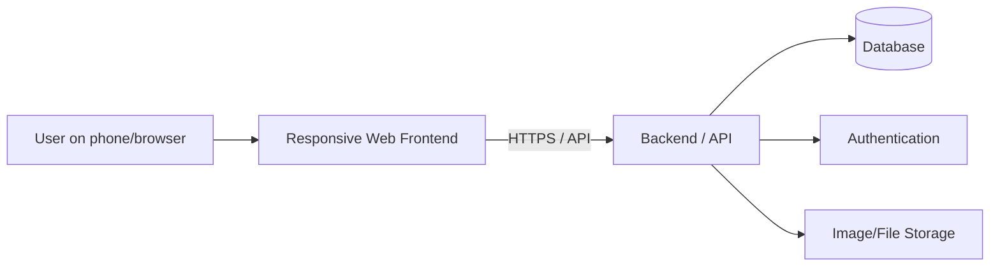

# Stadionhopper – Solution Architecture

## Purpose
This document describes how Stadionhopper can be built at a high level. The architecture supports the product goals, domain model, UX prototype, testing and later continuous integration.

## Architecture style
**Proposed approach: layered client–server architecture for a responsive web application.**

1. **Client / Frontend** – mobile-first responsive user interface.
2. **Backend / API** – application logic, validation and access control.
3. **Data layer / Database** – persistent storage of the domain entities.

This is proposed instead of separate native mobile applications and microservices for the first version because the current scope benefits from fewer deployable components and simpler testing.

## Main components

### Frontend
Responsibilities include login/profile, match and stadium discovery, check-in, visit history, social feed, events, presentation and client-side validation.

### Backend / API
Responsibilities include authentication/authorization integration, business rules, CRUD operations, check-in validation, feed/event endpoints, error handling and access to persistent data.

### Database
Stores Users, Stadiums, Clubs, Matches, CheckIns, Posts, Events and event attendance relationships. A relational model is an initial proposal because the domain has explicit relationships and cardinalities.

### Supporting services
Authentication and image/file storage may be external services if the team decides they are needed.

## High-level architecture

## Example data flow – Check-in
1. User opens a Match in the frontend.
2. Frontend retrieves Match, Club and Stadium information through the API.
3. User selects Check-in.
4. Frontend sends the request to the API.
5. Backend verifies the user and referenced Match/Stadium.
6. Backend creates the CheckIn in persistent storage.
7. API returns a success response.
8. Frontend shows confirmation and a route to Visit History.
9. Visit History retrieves the user's stored CheckIns.

## Key decisions and rationale
- **Responsive web rather than native apps:** mobile-friendly without separate iOS/Android implementations; easier access for testing.
- **Layered architecture rather than microservices:** adequate separation without unnecessary deployment and coordination complexity.
- **API boundary:** separates presentation from business/data logic and supports testing.
- **Relational storage as initial assumption:** maps naturally to Match–Club–Stadium and User–CheckIn relationships.
- **Media outside the core database when needed:** store file references/URLs on CheckIn or Post rather than binary files in the main data store.

## Connection to UX
The primary journey maps directly to the architecture:

`User -> Frontend -> Match/Stadium data -> CheckIn API -> Database -> Confirmation -> Visit History`

Profile, Social Feed and Events use the same frontend–API–database structure.

## Decisions still to confirm
- Exact frontend framework
- Backend technology
- Authentication solution
- Database technology
- Image/file storage
- Hosting/deployment platform
- One repository or multiple repositories

These remain proposals until the team confirms them through Issues/Pull Requests.
