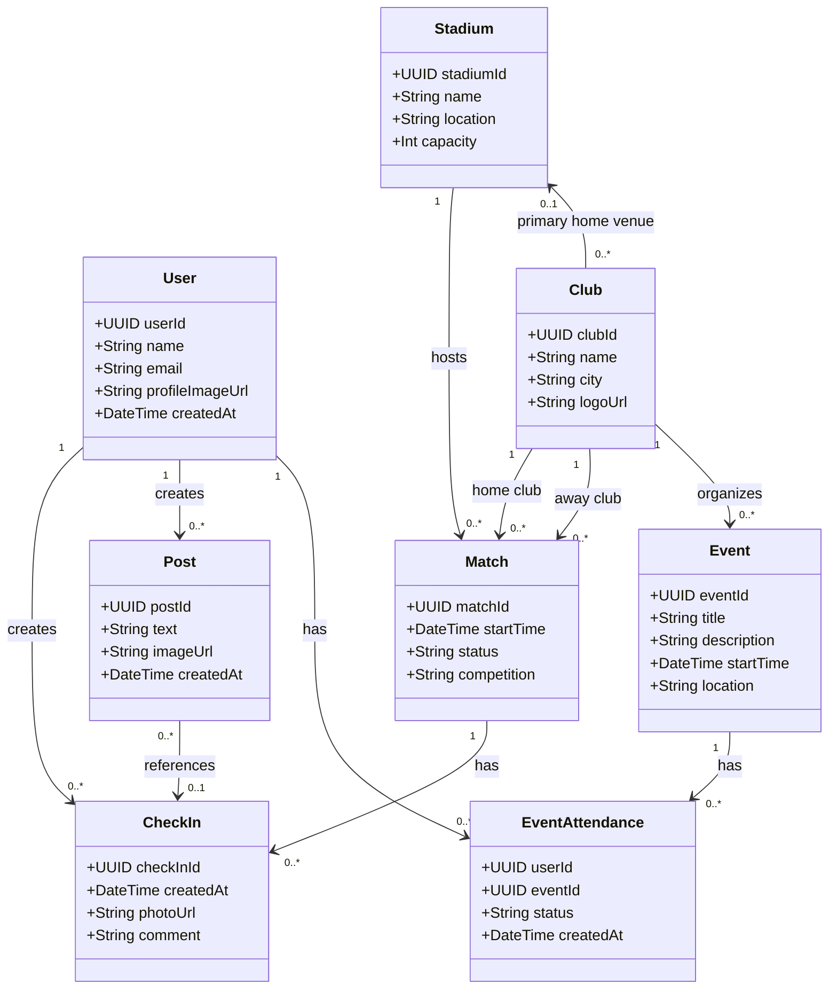

# Stadionhopper – Domain Model

## Purpose
The domain model translates the product concepts from Discovery into a technical model that the team can share, version and discuss in Git. It focuses on the minimum concepts required for Deliverable 2: User, Stadium, Club, Match, CheckIn, Post and Event.

## Core concepts

### User
Represents a person using Stadionhopper.
Suggested attributes: `userId`, `name`, `email`, `profileImageUrl`, `createdAt`.

Relationships:
- A User can create zero or many CheckIns.
- A User can create zero or many Posts.
- A User can attend zero or many Events.

### Stadium
Represents a football stadium that can host matches and receive check-ins.
Suggested attributes: `stadiumId`, `name`, `location`, `capacity`.

Relationships:
- A Stadium can host zero or many Matches.
- A Stadium can be the primary home venue for zero or many Clubs.

### Club
Represents a football club.
Suggested attributes: `clubId`, `name`, `city`, `logoUrl`.

Relationships:
- A Club can participate in many Matches.
- A Club can organize zero or many Events.
- A Club may have one primary home Stadium.

### Match
Represents a scheduled football match.
Suggested attributes: `matchId`, `startTime`, `status`, `competition`.

Relationships:
- Each Match has one home Club.
- Each Match has one away Club.
- Each Match is played at one Stadium.
- A Match can have zero or many CheckIns.

### CheckIn
Represents a user's recorded stadium visit connected to a match.
Suggested attributes: `checkInId`, `createdAt`, `photoUrl`, `comment`.

Relationships:
- Each CheckIn belongs to one User.
- Each CheckIn belongs to one Match.
- The Stadium for a match-based CheckIn is derived through the referenced Match.

For the first MVP, `Match.stadiumId` is the source of truth for the stadium of a match-based CheckIn. `CheckIn` therefore stores `matchId` rather than duplicating `stadiumId`. This avoids inconsistent data. If standalone stadium visits are introduced later, the model can be extended explicitly.

### Post
Represents content shown in the social feed.
Suggested attributes: `postId`, `text`, `imageUrl`, `createdAt`.

Relationships:
- Each Post is created by one User.
- A Post may reference a CheckIn.

### Event
Represents a supporter or club activity related to local football.
Suggested attributes: `eventId`, `title`, `description`, `startTime`, `location`.

Relationships:
- An Event may be organized by one Club.
- Many Users can attend many Events through EventAttendance.

## Relationship overview

## Connection to the UX and backlog
The model supports the main Sprint 1 flow:

`User -> Match -> Stadium -> CheckIn -> Visit History`

A user signs in, discovers a Match, sees the Stadium, creates a CheckIn and can later retrieve that CheckIn as part of visit history. Post and Event support the social feed and event interfaces required in the UX work.

## Modelling decisions
1. **CheckIn is a separate entity.** A stadium visit has its own timestamp and optional photo/comment and must be retrievable later.
2. **Match links two clubs with different roles.** Home club and away club should be represented as separate role-based relationships.
3. **Post is separate from CheckIn.** Not every check-in must become a social post, and future posts may exist without a check-in.
4. **Event is separate from Match.** A supporter meetup or club activity is not necessarily a football match.
5. **User–Event is many-to-many through EventAttendance.** The association entity makes RSVP status explicit and can later store attendance-related metadata.
6. **The model stays deliberately small.** Followers, notifications, badges, tickets and live scores are not modelled as core entities at this stage because they are not necessary for the minimum Deliverable 2 domain model.

## Initial modelling decisions for the proposed MVP
- A Match has one Stadium and `Match.stadiumId` is the source of truth for match-based check-ins.
- A Club can optionally have one primary home Stadium; a Stadium may be used by multiple Clubs.
- Event participation is represented through EventAttendance so RSVP status can be stored explicitly.

## Open decisions
- Whether Events can be created by ordinary Users as well as Clubs.
- Whether Posts can exist independently of CheckIns.
- Whether Match status/competition should be enums or simple text in the first implementation.

These are proposed modelling choices for Deliverable 2 and should not be presented as confirmed group decisions unless the group later confirms them.
